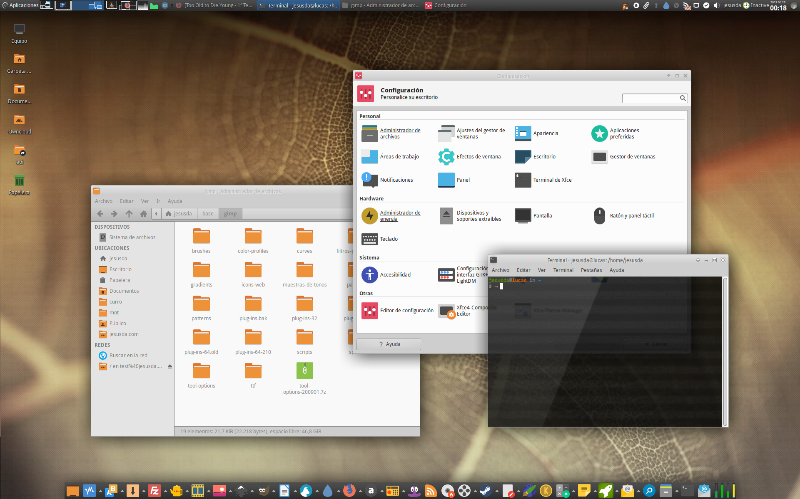

# The Perfect GNU/Linux Destop
A collection of some configuration files to make your desktop easily great! ;).

By [jEsuSdA](http://www.jesusda.com)

## Compton

[Compton](https://github.com/chjj/compton) and [Picom](https://github.com/yshui/picom) are compositors for X11 wich add some effects to our desktop. Picom is a modern and up-to-date Compton fork.

- Here you can find my [compton.conf](compton-picom/compton.conf) file.
- Here you can find my [picom.conf](compton-picom/picom.conf) file.

*You must copy the .conf files into your ~/.config/ folder* 

Read [this atricle](http://duncanlock.net/blog/2013/06/07/how-to-switch-to-compton-for-beautiful-tear-free-compositing-in-xfce/) to get some info about Compton.

## Fonts
Fonts configuration files and howtos to allow better font rendering.

## THEMEs

### Greybird

[Greybird GTK theme](https://github.com/shimmerproject/Greybird) is a complete GTK+ theme for desktop.

The **greybird-patched** folder contains a patched version of it. I made some patches to avoid some bugs and adding some extra features.

You can find a XFWM4 themes too (Window decoration themes for the XFCE window manager).

*Unzip 7z files and copy folder to /usr/share/themes or ~/.themes/*

Or using the installation script (If you use Debian).

### Papirus

[Papirus Icon theme](https://github.com/PapirusDevelopmentTeam/papirus-icon-theme/) is a complete awesome Icon Theme.

The **papirus-patched** folder contains a patched version of it. I made some patches to add some extra features I like.

*Unzip 7z files and copy foldes to /usr/share/icons or ~/.icons/*

Or using the installation script (If you use Debian).

You can also install some **Papirus extra patches** for applications like aMule, FBreader, gFTP, Remarkable, etc.

### XFWM4 Window Themes

The **xfwm4-themes** folder contains a some themes for the XFCE Window Manager. They are bases upon the Greybird and XFWM4 main themes.

*Unzip 7z files and copy folders to /usr/share/themes/ or ~/.themes/*

## Bashrc files
These files configure the **bash console** to add some features like personalized and colorized prompt and some tweaks for java look and GTK+3.

*Copy the user.bashrc to ~/.bashrc
Copy the root.bashrc to /root/.bashrc*

## Sound theme

All you need to activate sound theme into your XFCE Desktop. You know, play sounds when you do things! ;)

# License

All the scripts are publised under the [GNU General Public License V3](https://www.gnu.org/licenses/gpl.html).
