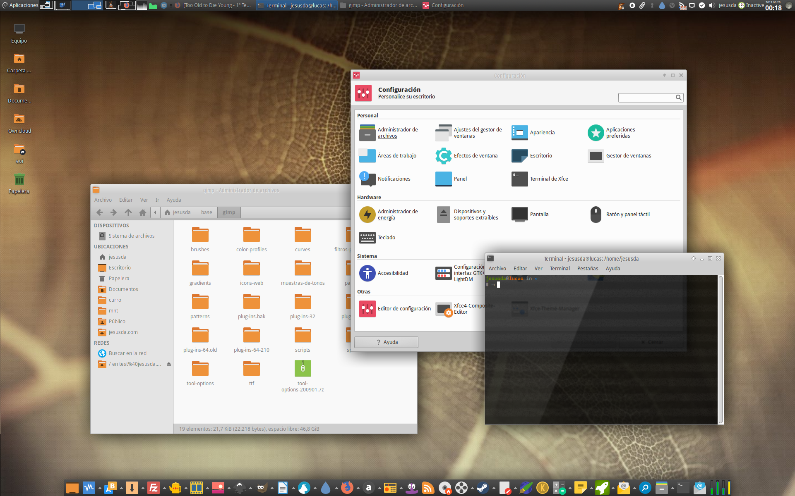

# The Perfect GNU/Linux Destop
A collection of some configuration files to make your desktop easily great! ;).

By [jEsuSdA](http://www.jesusda.com)

## Fonts
Fonts configuration files and howtos to allow better font rendering.

## THEMEs

### Greybird

[Greybird GTK theme](https://github.com/shimmerproject/Greybird) is a complete GTK+ theme for desktop.

The **greybird-patched** folder contains a patched version of it. I made some patches to avoid some bugs and adding some extra features. Also GTK4 support is added.

You can find a XFWM4 themes too (Window decoration themes for the XFCE window manager).

*Unzip 7z files and copy folder to /usr/share/themes or ~/.themes/*

Or using the installation script (If you use Debian).

### Papirus

[Papirus Icon theme](https://github.com/PapirusDevelopmentTeam/papirus-icon-theme/) is a complete awesome Icon Theme.

The **papirus-patched** folder contains a patched version of it. I made some patches to add some extra features I like. I also added the ePapirus version, that was removed from official Papirus icon theme time ago.

*Extract the .tar.xz file and copy folders to /usr/share/icons or ~/.icons/*

Or using the installation script **install-papirus.sh**:

    ./install-papirus.sh                          # download + install latest
    ./install-papirus.sh papirus-20260728.tar.xz  # install a specific local file

You can also install some **Papirus extra patches** for applications like aMule, FBreader, gFTP, Remarkable, etc.

### XFWM4 Window Themes

The **xfwm4-themes** folder contains a some themes for the XFCE Window Manager. They are bases upon the Greybird and XFWM4 main themes.

*Unzip 7z files and copy folders to /usr/share/themes/ or ~/.themes/*

## Bashrc files
These files configure the **bash console** to add some features like personalized and colorized prompt and some tweaks for java look and GTK+3.

*Copy the user.bashrc to ~/.bashrc
Copy the root.bashrc to /root/.bashrc*

## Compositors

You can add shadows, transparency, rounded corners and even animation to your windows using some of the X Compositors you can find here. Configuration files and launcher included.

If you have problems with drop-down shadows in latest Google Chrome versions, please, change this flags ( chrome://flags/ ) to disble the "UI refresh theme" and you get a better integration and look and feel. [Google Chrome](compositors/google-chrome_shadows-workaround.png)

## Sound theme

All you need to activate sound theme into your XFCE Desktop. You know, play sounds when you do things! ;)

# License

All the scripts are publised under the [GNU General Public License V3](https://www.gnu.org/licenses/gpl.html).
