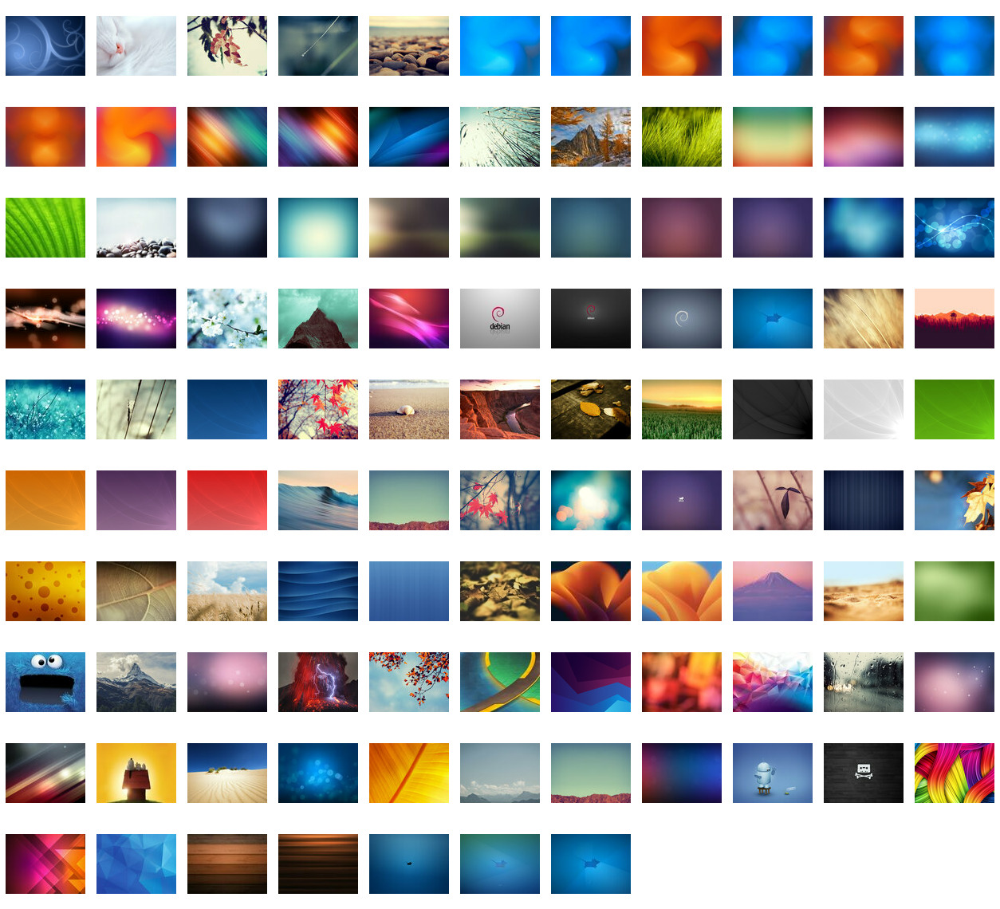

# The Perfect GNU/Linux Destop
A collection of some configuration files, themes and graphic sets to make your desktop great again! ;).

By [jEsuSdA](http://www.jesusda.com)

Simple, elegant, beautiful

## Compton

[Compton](https://github.com/chjj/compton) is a compositor for X11 wich adds some effects to our desktop.
Here you can find my [compton.conf](compton/compton.conf) file

*You must copy it into your ~/.config/compton.conf*

Read [this atricle](http://duncanlock.net/blog/2013/06/07/how-to-switch-to-compton-for-beautiful-tear-free-compositing-in-xfce/) to get some info about Compton.

## THEMEs

### Greybird

[Greybird GTK theme](https://github.com/shimmerproject/Greybird) is a complete GTK+ theme for desktop.

The **greybird-patched** folder contains a patched version of it. I made some patches to avoid some bugs and adding some extra features.

You can find a XFWM4 themes too (Window decoration themes for the XFCE window manager).

*Unzip 7z files and copy folder to /usr/share/themes or ~/.themes/*

### Papirus

[Papirus Icon theme](https://github.com/PapirusDevelopmentTeam/papirus-icon-theme/) is a complete awesome Icon Theme.

The **papirus-patched** folder contains a patched version of it. I made some patches to add some extra features I like.

*Unzip 7z files and copy foldes to /usr/share/icons or ~/.icons/*

### XFWM4 Window Themes

The **xfwm4-themes** folder contains a some themes for the XFCE Window Manager. They are bases upon the Greybird and XFWM4 main themes.

*Unzip 7z files and copy folders to /usr/share/themes/ or ~/.themes/*

### Terminal Background

A background to configure the  **xfce4-terminal** (or other ones) looking awesome.

*Download the terminal-kgt-background.png file and configure xfce-terminal like [Terminal configuration](screenshots/xfce-terminal-configuration.png)*

### Wallpapers

Some wallpapers from several sources.

# License

All the scripts and contents are publised under the [GNU General Public License V3](https://www.gnu.org/licenses/gpl.html).
