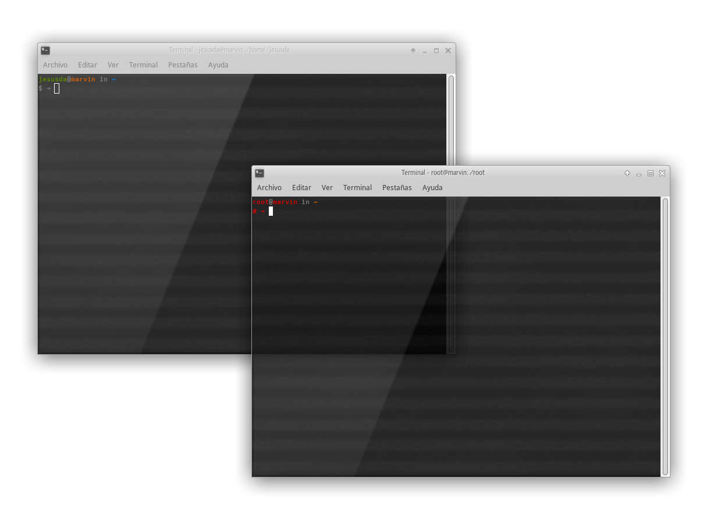

# Bashrc files

Personalized `.bashrc` files with Solarized color scheme prompt, git branch status, Java font tweaks, and GTK CSD disabled via `nocsd` preload.

- **`user.bashrc`** — copy to `~/.bashrc`. Sets editor to `scite`, enables `nocsd` for GTK3 CSD removal, configures `_JAVA_OPTIONS` for better font rendering, colorized man pages, and custom PATH (`~/.opencode/bin`).
- **`root.bashrc`** — copy to `/root/.bashrc`. Red-themed prompt, same Java/GTK tweaks.



## Installation

```sh
cp user.bashrc ~/.bashrc
sudo cp root.bashrc /root/.bashrc
```
