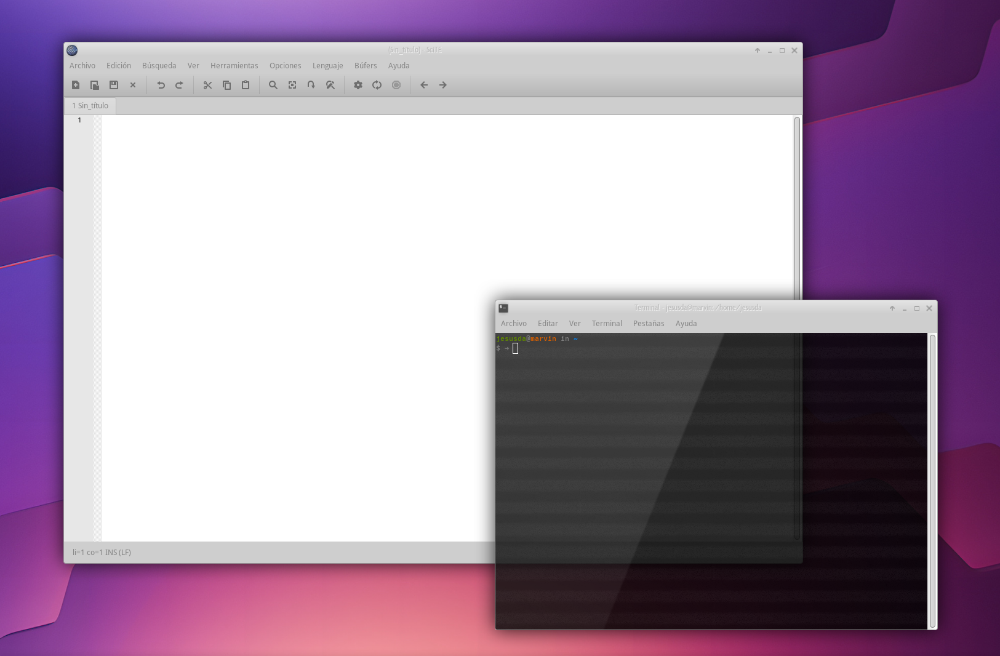

# X COMPOSITORS

One way to make your desktop look more visually appealing and modern is to add a window compositor.

These compositors can add shadows, blur, rounded corners, and even animations to windows and popups.

Personally, I prefer the lightest compositors possible. They should make the desktop look good while also running smoothly.

Here are my favorite compositors.

You can install them directly from your distro's repositories, compile them from source, or directly download the binaries I've provided here.




---

## COMPTON

[https://github.com/chjj/compton](https://github.com/chjj/compton)

Almost the beginning of it all, and the first compositor I ever knew and used. A compositor based on xcompmgr-dana, which in turn was based on an earlier xcompmgr compositor...

It's no longer maintained. The advantage is that it's good enough, efficient, and mature. It gets the job done.

## PICOM

[https://github.com/yshui/picom](https://github.com/yshui/picom)

It's an evolution of Compton... and what an evolution! Improved shadows, vsync, animations, finer and more precise configuration...

It's actively maintained and works very well; however, it's no longer as lightweight as it once was and consumes a few more resources, given its power.

- **Repo**: https://github.com/yshui/picom
- **Active Branch**: `next` (v13)
- **License**: MIT
- **Backend**: GLX + XRender
- **Features**: Shadows, blur (dual_kawase), rounded corners, transparency, fading, script-based animations (v12+), D-Bus, damage-driven repaint, VSync
- **Strengths**: Most complete and compatible. Huge community. Comprehensive documentation. Powerful animation system (7 presets, scripting, cubic-bezier)
- **Weaknesses**: Heavier than fastcompmgr (4-17x more CPU usage in benchmarks). Complex dependencies. - **Recommendation**: **General Use** — when you need maximum compatibility, documentation, and features

## FASTCOMPMGR

[https://github.com/tycho-kirchner/fastcompmgr](https://github.com/tycho-kirchner/fastcompmgr)

It's also a fork of Compton, but focused on being as efficient and fast as possible. It sacrifices features like fading and animations for maximum efficiency.

The version you can find compiled here is, in turn, a patched version I created to achieve even greater efficiency and speed [more information here](https://github.com/tycho-kirchner/fastcompmgr/issues/35).

For me, it's the perfect balance between power and efficiency. It doesn't require any configuration files. Just run it with parameters and you're good to go.

- **Repo**: https://github.com/tycho-kirchner/fastcompmgr
- **License**: MIT
- **Backend**: XRender only
- **Features**: Shadows, idle opacity, damage-driven, occlusion culling. 14 AI optimizations (O(1) hash table, visual format cache, alpha picture cache, etc.)
- **Strengths**: **4-17x faster than picom** on CPU. Minimal dependencies. Clean and auditable code. Extensive documentation (AI_OPTIMIZATIONS.md, ROADMAP.md)
- **Weaknesses**: No vsync (most requested issue). No blur. No animations. No config file (CLI only). Intentionally broken fading. XRender only.
- **Recommendation**: **Extreme performance** — when you prioritize FPS and CPU over visual features

---


| Compositor | Backend(s) | Shadows | Blur | Animations | VSync | Config | Size | Dependencies | CPU | RAM | Recommendation |

---|---|---|---|---|---|---|---|---|---|---|---|

**picom** | GLX, XRender | ✅ | ✅ dual_kawase | ✅ script-based (7 presets) | ✅ | picom.conf | Large | Medium | ⚠️ Medium | ⚠️ Medium | General Purpose |

**fastcompmgr** | XRender | ✅ | ❌ | ❌ | ❌ | CLI Only | ~70K | Minimal | ✅ Very Low | ✅ Very Low | Extreme Performance |

---

## INSTALLATION

Download and copy the binaries to /usr/bin and ensure they are executable using chmod +x.

- [compton](compton)
- [picom](compton)
- [fastcompmgr](fastcompmgr)

Configuration files to place in ~/.config

- [compton.conf](compton.conf)
- [picom.conf](compton.conf)
- fastcompmgr is not needed

---

## RUNNING

To facilitate running and switching between compositors, I've created a script that you can also copy to /usr/bin. This will allow you to easily launch either compositor.

You can download it here. [compositor.sh](compositor.sh)

And you run it with:

```
compositor.sh <xfwm4|picom|compton|fc|fastcompmgr|--help>
```
