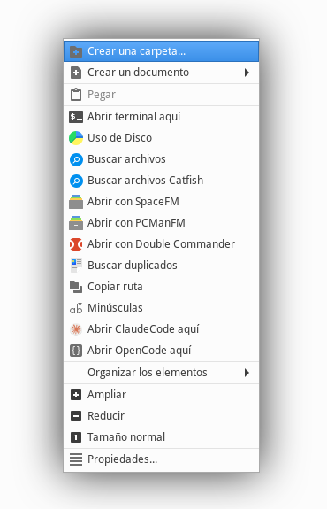

# Thunar Custom Actions

Custom right-click actions for the [Thunar](https://docs.xfce.org/xfce/thunar/start) file manager.



## Installation

Copy `thunar.uca.xml` to `~/.config/Thunar/`:

```sh
cp thunar.uca.xml ~/.config/Thunar/
```

Open Thunar → Edit → Configure custom actions to verify.

## Available actions

- **Open terminal here**
- **Disk usage** (`baobab`)
- **Search files** (`catfish`)
- **Find duplicates** (`fdupes`)
- **Convert to JPG**, **Optimize JPG**, **Rotate JPG**
- **Optimize PDF**, **Rasterize PDF**
- **Markdown conversions** to PDF, HTML, ODT
- **Convert to PDF** (docx/doc)
- **Extract RAR**
- **Copy path**
- **Rename to lowercase**
- **MD5 doc**
