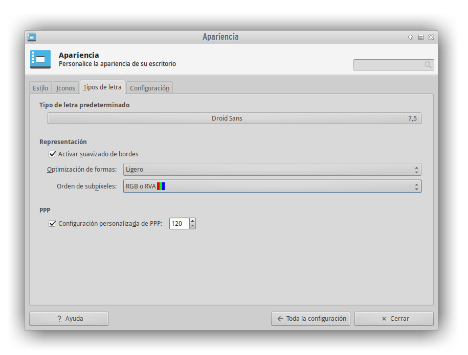
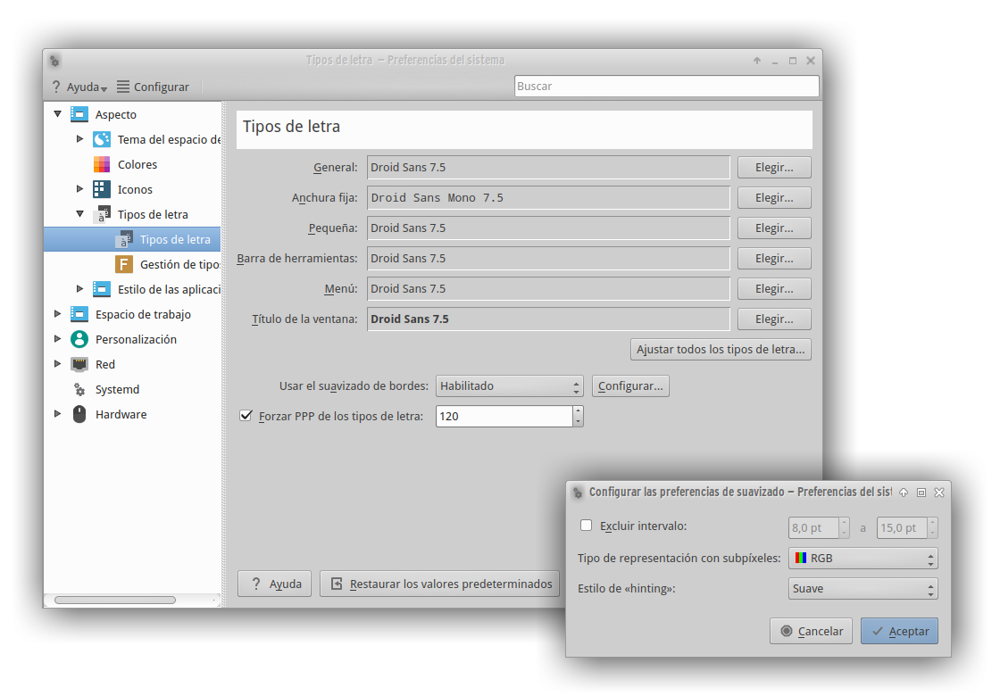

# Fonts

Nice and extremely well-made fonts for your desktop.

I recommend the following fonts:

- **Desktop/Apps/Regular Fonts**:
	- Adwaita Regular
	- Droid Sans
	
- **Terminal/Code/Monospace Fonts**:
	- Adwaita Mono
	- JetBrains Mono

By selecting the appropriate font, you can achieve a beautiful appearance and improved legibility.

## fonts.conf

A configuration file of font rendering to copy into:
`/home/<user>/.config/fontconfig/`

## XFCE Configuration

## KDE/Plasma Configuration

