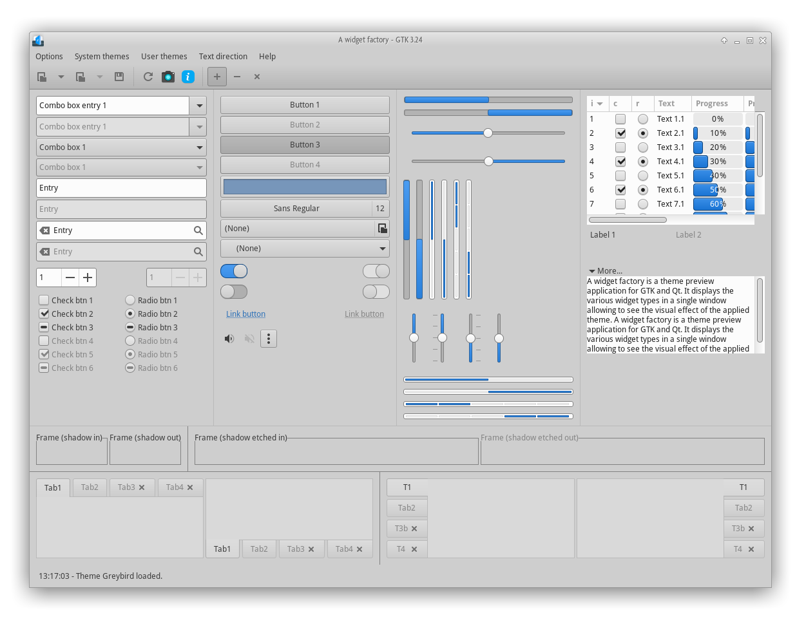

# Greybird-patched GTK Theme

Patched version of the [Greybird GTK theme](https://github.com/shimmerproject/Greybird) with bugfixes, GTK4 support, and extra features.



## Patches included

- Tooltip border-radius fix (set to 0)
- Notification border-radius fix
- Dotted scroll border fix
- Double shadow fix for Compiz
- Toolbar gradient restoration
- Synaptic fixes
- GTK3 + XFWM4 popup shadows
- Compton popup CSD fix
- Firefox/Thunderbird popup menu fixes
- Geany GTK3 fixes
- Dark icon color fix
- Print dialog fix
- Tab gradient styling
- Thunar >1.8 fixes
- Full list in `greybird-patches.txt`
- GTK4 Support

## Installation

```sh
sudo ./install-greybird.sh Greybird-20260728.7z
```

Or manually extract the `.7z` to `/usr/share/themes/`.

## Firefox / Thunderbird

- **`firefox_chrome/`** — Greybird styles and fixes for Firefox. Copy contents to `~/.mozilla/firefox/<profile>.default/chrome/`.
- **`thunderbird_chrome/`** — Greybird styles + ePapirus icons for Thunderbird 60+. Copy to `~/.thunderbird/<profile>.default/chrome/`.

## Kvantum

`kvantum-theme_greybird.7z` — Kvantum theme for Qt/KDE apps.
