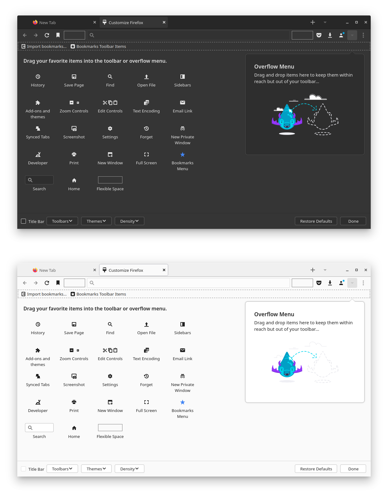

<h1 align="center">
	<br>
 Firefox Papirus icon theme
</h1>

<p align="center"><strong>A Papirus icon theme for Firefox</strong></p>



## Description

This is only icon theme and not contained GTK UI style.

This theme is supposed to work with current supported Firefox releases:

- Firefox 89

## Installation

### Installation script

Clone this repo and enter folder and run script:

```sh
git clone https://github.com/PapirusDevelopmentTeam/firefox-papirus-icon-theme.git && cd firefox-papirus-icon-theme
./scripts/install.sh
```

#### Install script

```sh
./scripts/install.sh # Standard
./scripts/install.sh -f ~/.var/app/org.mozilla.firefox/.mozilla/firefox # Flatpak
```

##### Script options

- `-f <firefox_folder_path>` *optional*
    - Set custom Firefox folder path, for example `~/.mozilla/icecat/`.
    - Default: `~/.mozilla/firefox/`

- `-p <profile_name>` *optional*
    - Set custom profile name, for example `e0j6yb0p.default-nightly`.
    - Default: All the profiles found in the firefox folder

## Uninstalling

1. Go to your profile folder. (Go to `about:support` in Firefox > Application Basics > Profile Directory > Open Directory)
2. Remove `chrome` folder.

## Development

If you wanna mess around the styles and change something, you might find these
things useful.

To use the Inspector to debug the UI, open the developer tools (F12) on any
page, go to options, check both of those:

- Enable browser chrome and add-on debugging toolboxes
- Enable remote debugging

Now you can close those tools and press Ctrl+Alt+Shift+I to Inspect the browser
UI.

Also you can inspect any GTK3 application, for example type this into a terminal
and it will run Epiphany with the GTK Inspector, so you can check the CSS styles
of its elements too.

```sh
GTK_DEBUG=interactive firefox
```

## Credits

Used scripts by **[Rafael Mardojai CM](https://github.com/rafaelmardojai)** and [contributors](https://github.com/rafaelmardojai/firefox-gnome-theme/graphs/contributors). Based on **[Sai Kurogetsu](https://github.com/kurogetsusai/firefox-gnome-theme)** original work.

## Donate
