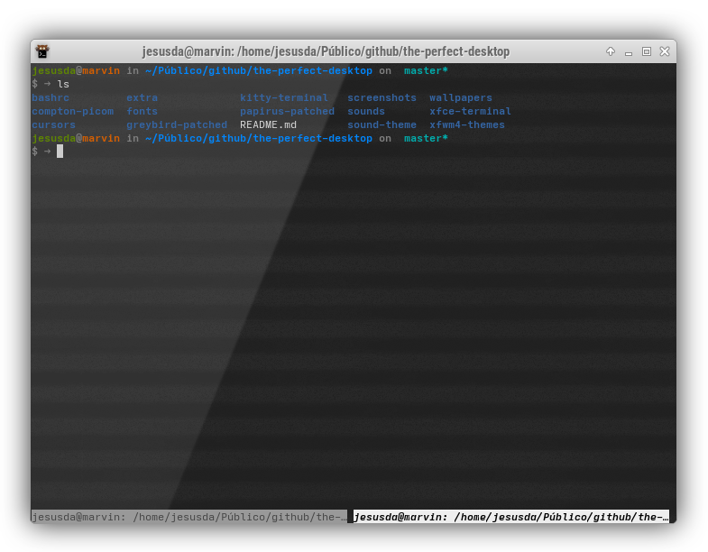

# Kitty Terminal Background and config

A background to configure the  **xfce4-terminal** (or other ones) looking awesome.

Download the terminal-kgt-background-kitty.png and kitty.conf files and copy to ~/.config/kitty

You can edit kitty.conf file to configure your kitty terminal.