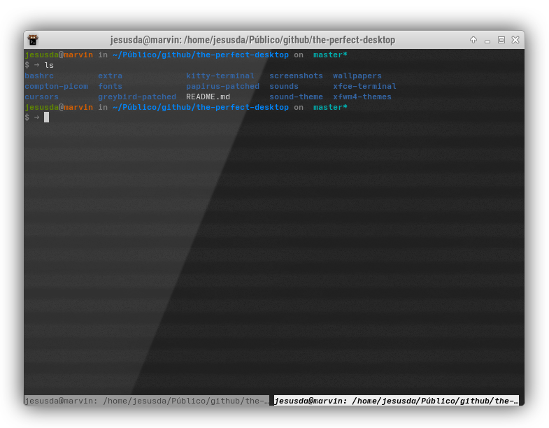

# Kitty Terminal Background and config

A background and config file to make the  **kitty-terminal** looking awesome.




## Installation

```sh
cd kitty-terminal && ./install.sh
```

Or manually: copy `kitty.conf` and `terminal-kgt-background-kitty.png` to `~/.config/kitty/`.

You can edit `kitty.conf` to configure your terminal.