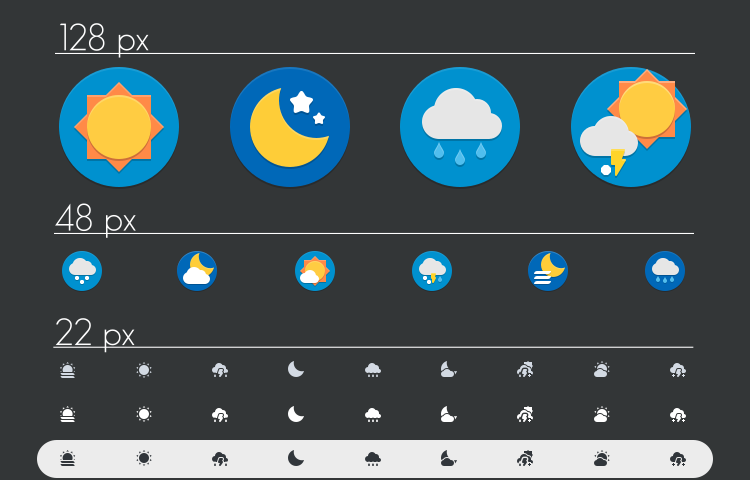

# XFCE4-Weather-Plugin icons

Icons heavily inspired by the Papirus Icon theme.

Source and credits: [Art2 at deviantart.com ](https://www.deviantart.com/art-2/art/Iconos-Clima-para-xfce4-weather-plugin-581282954)

## Howto

System wide installation using install.sh script.

Or you can install it manually:

Copy the folders inside icon folder in your 

~/.config/xfce4/weather/icons/

## Notice:

You must use a panel size of 24 px

If the folders "weather" and "icons" does not exists, create it.

For xfce4-panel 4.13.4 set the "Fixed Icons Size (pixels):" 16
