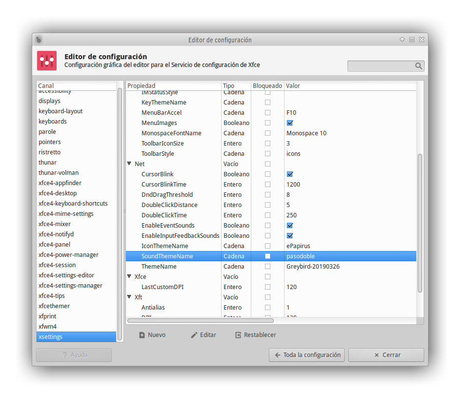

# Activate sound theme in XFCE

## 1 Install sound theme:

Run install.sh or copy pasodoble folder into /usr/share/sounds/

## 2 Install packages:

apt-get install dconf-tools sound-theme-freedesktop xfconf pavucontrol
apt-get install sox gnome-session-canberra at-spi2-core xdg-utils

## 3 Test loaded camberra-gtk-modules 

In terminal:

echo $GTK_MODULES

You should watch something like that:

$ → echo $GTK_MODULES
gail:atk-bridge:canberra-gtk-module

If "canberra-gtk-module" does not appears, you should force load this module doing that:

create the file 
/etc/profile.d/gtk-modules-camberra.sh

with thist content:

	#!/bin/sh
	export GTK_MODULES=$GTK_MODULES:canberra-gtk-module:topmenu-gtk-module

Make it executable (as root)

chmod +x /etc/profile.d/gtk-modules-camberra.sh

Or you can do this creating a .gtkrc-2.0 file in your $HOME with the following contents:
gtk-modules = "canberra-gtk-module:topmenu-gtk-module"

Or putting 

export GTK_MODULES=$GTK_MODULES:canberra-gtk-module

in your ~/.xprofile or ~/.xinitrc

Doing any of these steps and re-login, you must see this 

gail:atk-bridge:canberra-gtk-module

after typing

echo $GTK_MODULES

## 4 Enable event sounds

Check "Enable event sounds" in Settings Manager → Appearance → Settings tab;

	gconftool-2 -s /desktop/gnome/sound/theme_name "pasodoble" -t string 
	gconftool -s /desktop/gnome/sound/theme_name "pasodoble" -t string

Go to deconf-editor > /org/gnome/desktop/sound.

Make sure the Event Sounds & feedback sounds boxes are ticked.
Then change the theme name to "pasodoble" (without the quotes)

Do the same with gconf-editor

## 5 Select 'pasodoble' sound theme

In the Settings Editor set "xsettings/Net/SoundThemeName" to a sound theme located in /usr/share/sounds/

## 6 Extra

Test your System Sounds volume is high enough

May be you have to turn on "System Sounds" in audio mixer (e.g. pavucontrol)

## 7 Testing

After reboot, you can test:

	/usr/bin/canberra-gtk-play -i trash-empty

Or using test-theme-global.sh script

## Extra

### Activate sound on terminal 

Go to .config/Terminal/
Open terminalrc in a text editor.
Find the MiscBell setting, and change it to TRUE.

### gtk3

Another thing you may try if you don't want to go to the gnome-settings-daemon route is create 

	~.config/gtk-3.0/settings.ini 

	[Settings]
	gtk-enable-event-sounds=true
	gtk-enable-input-feedback-sounds=true
	gtk-sound-theme-name=pasodoble

## More info

- https://wiki.archlinux.org/index.php/Xfce#Sound_themes
- https://old.reddit.com/r/xfce/comments/booaz3/how_to_make_notifications_play_a_sound/
- https://wiki.archlinux.org/index.php/Libcanberra

