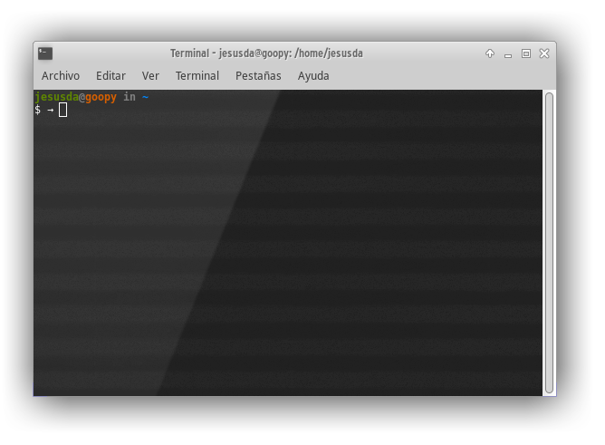
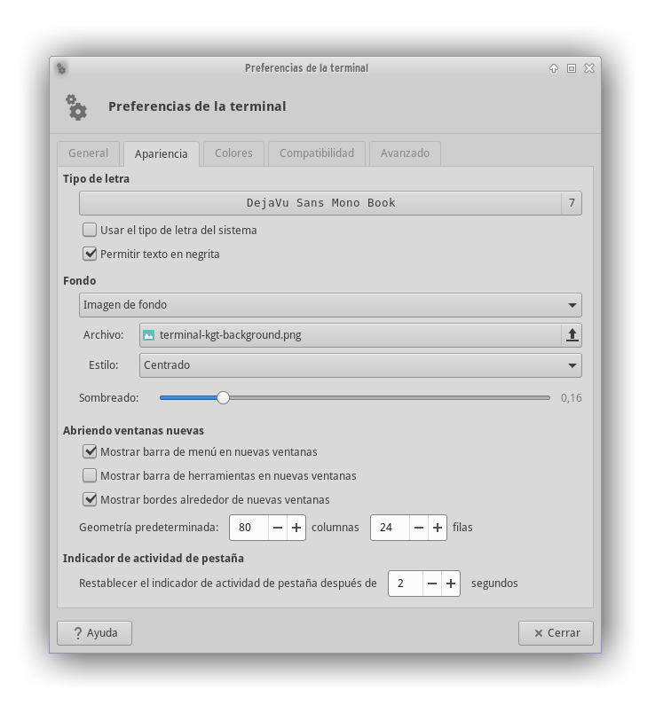

# Terminal Background

A background to configure the  **xfce4-terminal** (or other ones) looking awesome.




## Installation

```sh
cd xfce-terminal && ./install.sh
```

Or manually: copy the background PNGs to `~/.local/share/xfce4/backgrounds/` and configure xfce-terminal like this:




# Recommendation

Use terminal-kgt-background.png with compton (with our compton.conf)
and terminal-kgt-background-2.png with picom (with "use-damage = true" activated)


