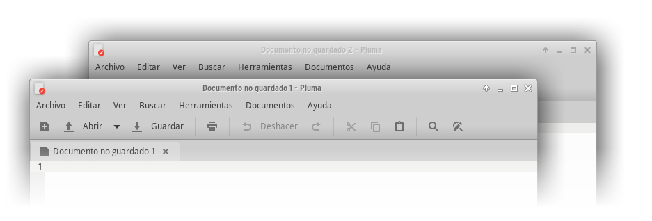
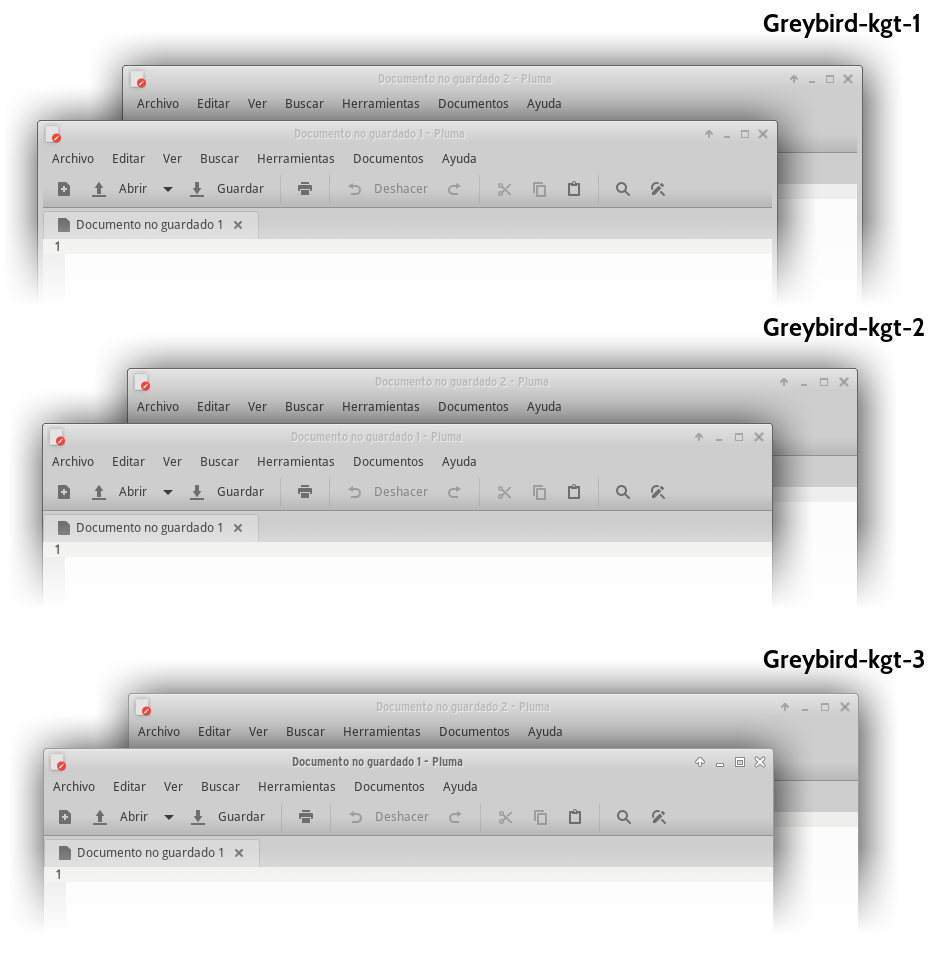

# XFWM4 Window Themes

**xfwm4-themes** for the [XFCE Window Manager](https://wiki.archlinux.org/index.php/Xfwm).

*Unzip 7z files and copy folders to /usr/share/themes/ or ~/.themes/*

## Gallery

